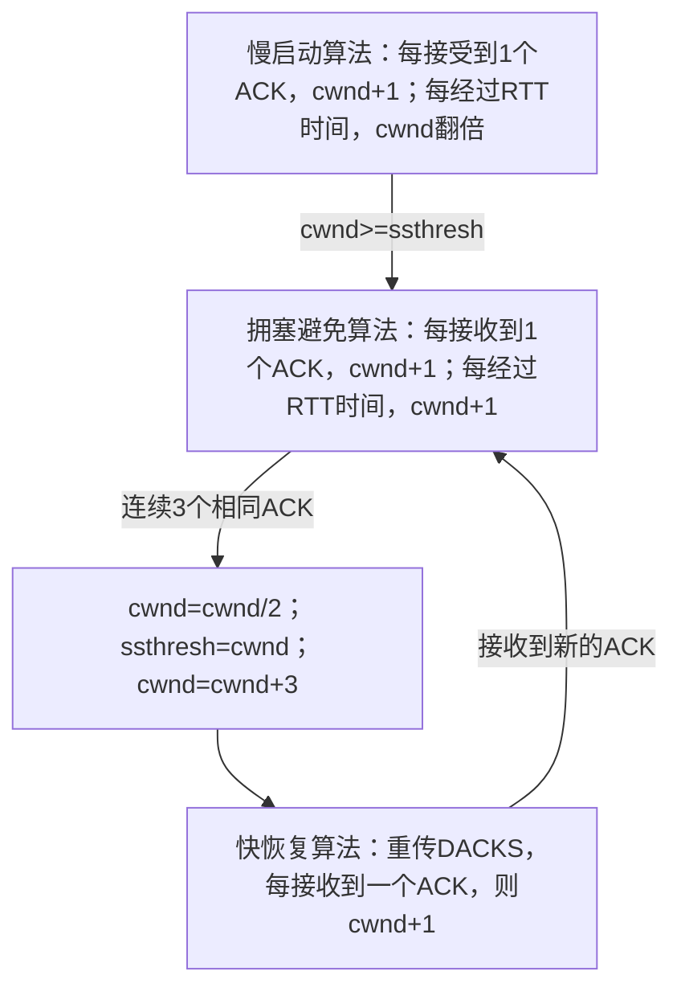

# 实验3-3 拥塞算法设计

1811386 刘佳浩

#### reno拥塞算法：

reno算法是目前较为流行的TCP拥塞控制算法。虽然我们并不是使用的UDP协议，但是在前几个实验中我们已经将我们的UDP协议设计得足够可靠了。因此，这里我就基本上仿照的reno算法，加入到我的UDP传输程序中。

我向client程序中加入了几个重要参数：

**WINDOWSIZE**：滑动窗口大小。因为实验中不考虑接收端状态，因此WINDOWSIZE参数放在发送端也就是client程序中处理

**RTO**：超时重传时间。超过这段时间文件将会进行重传。因为引入了reno算法，RTO的值是动态设置的，默认为=200
**RTT，SRTT**：往返时间和平滑往返时间。SRTT是根据以往所有包的RTT计算得出的取值较为平均的RTT时间，RTO和其他参数的设置又要依据SRTT来进行改变
**cwmd**：拥塞窗口大小

**ssthress**：启动阈值。超过ssthress的值，将会改变reno算法的状态

**sendsize**：实际的发送窗口大小。同样也是动态的，是WINDOWSIZE和cwmd中的较小值

server端不做处理。reno只修改client端的参数

reno算法的自动机为：

修改后完成文件传输

